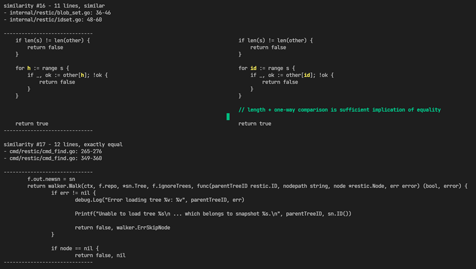

[](https://pkg.go.dev/github.com/blizzy78/textsimilarity)


textsimilarity
==============

A Go package to analyze files for copied and pasted (and possibly slightly modified) text.

This can be used to not only find exactly equal occurrences, but also occurrences that have slight modifications,
such as names of variables changed in source code.


Command Line Usage
------------------

The `cmd/` folder provides a standalone command line utility. You can build it like this:

```
go build -o textsimilarity ./cmd/
```

For example, you can now run it against [restic] source code, with [icdiff] as a diff tool:

~~~bash
$ git clone https://github.com/restic/restic.git
$ cd restic

$ textsimilarity -progress \
	-ignoreWS -ignoreBlank -minLen 6 -minLines 10 -maxDist 3 \
	-ignoreRE '^(package|import|[ \t]*(\*|//))' \
	-diffTool 'icdiff --cols=150 --tabsize=4 --no-headers -W {{.File1}} {{.File2}}' \
	-printEqual \
	$(find . -type f -name '*\.go' |egrep -v '_test.go|build.go|helpers/')
~~~

This will result in the following output:

[](similarities.png)

_(Click to enlarge. This is only part of the output.)_


License
-------

This package is licensed under the MIT license.


[restic]: https://github.com/restic/restic
[icdiff]: https://github.com/jeffkaufman/icdiff
